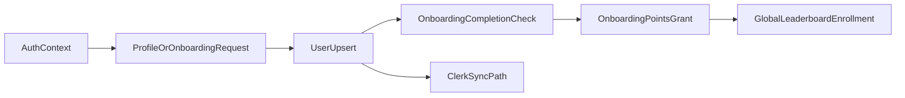

## Primary backend components

- `app/api/user/profile/route.ts`
- `app/api/user/onboarding/route.ts`
- `app/api/auth/native-token/route.ts`
- `server/onboarding-actions.ts`
- `server/auth-actions.ts`
- `lib/server-auth.ts`
- `lib/clerk-sync.ts`

## Core model touchpoints

- `User`
- `ConnectedAccount`
- `PointsHistory` (onboarding reward write)
- `LeaderboardEntry` (global enrollment path from onboarding profile flow)

## High-level flow

## Architectural notes

- Runtime auth is primarily request-context based and route-gated.
- Profile write flow performs synchronization between auth identity and app user data.
- Onboarding completion can trigger downstream quest progress checks and point history writes.
- Non-admin docs intentionally exclude privileged impersonation and admin user management flows.
