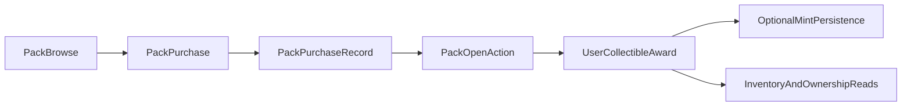

## Primary backend components

- `server/collectible-actions.ts`
- `server/pack-actions.ts`
- `server/featured-collectible-actions.ts`
- `server/minting-actions.ts`
- `lib/pack-odds.ts` — centralized odds computation and openability checks
- `lib/weighted-random.ts` — weighted draw engine used during pack opening
- `app/api/packs/route.ts`
- `app/api/packs/[id]/route.ts`
- `app/api/packs/[id]/purchase/route.ts`
- `app/api/packs/[id]/open/route.ts`
- `app/api/packs/[id]/odds/route.ts` — canonical odds disclosure endpoint
- `app/api/user/collectibles/route.ts`
- `app/api/user/packs/route.ts`

## Core model touchpoints

- `Collectible`
- `Pack`
- `PackCollectible`
- `PackPurchase`
- `UserCollectible`
- `MintedNFT`

## High-level flow

## Architectural notes

- Pack open behavior resolves weighted contents and persists ownership outcomes.
- Collectible ownership and mint records are related but not identical entities.
- Featured collectible views are read-optimized on top of core ownership models.
- Odds computation is centralized in `lib/pack-odds.ts` — the draw engine in `server/minting-actions.ts` and `lib/weighted-random.ts` uses the same weight model that the odds endpoint discloses.
- `Product.metadata.dropRates` is a disclosure projection only; the `PackCollectible.weight` and `PackCollectible.quantity` fields are the draw source of truth.
