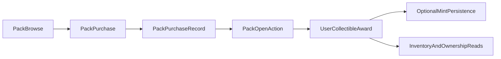

## Primary backend components

- `server/collectible-actions.ts`
- `server/pack-actions.ts`
- `server/featured-collectible-actions.ts`
- `server/minting-actions.ts`
- `app/api/packs/route.ts`
- `app/api/packs/[id]/route.ts`
- `app/api/packs/[id]/purchase/route.ts`
- `app/api/packs/[id]/open/route.ts`
- `app/api/user/collectibles/route.ts`
- `app/api/user/packs/route.ts`
- `app/api/user/featured-collectibles/route.ts`
- `app/api/binders/[id]/route.ts`
- `app/api/binders/[id]/verify-pin/route.ts`
- `app/api/v1/cards/[id]/provenance/route.ts`
- `server/binder-actions.ts`
- `server/card-provenance-actions.ts`

## Core model touchpoints

- `Collectible`
- `Pack`
- `PackCollectible`
- `PackPurchase`
- `UserCollectible`
- `UserFeaturedCollectible`
- `MintedNFT`
- `MarketSale` (provenance transfers)
- Binder models (`Binder`, binder cards)

## High-level flow

```mermaid
flowchart LR
  packBrowse[PackBrowse] --> packPurchase[PackPurchase]
  packPurchase --> purchaseRecord[PackPurchaseRecord]
  purchaseRecord --> packOpen[PackOpenAction]
  packOpen --> collectibleAward[UserCollectibleAward]
  collectibleAward --> mintPath[OptionalMintPersistence]
  collectibleAward --> inventoryRead[InventoryAndOwnershipReads]
```

## Architectural notes

- Pack open behavior resolves weighted contents and persists ownership outcomes.
- Collectible ownership and mint records are related but not identical entities.
- Featured collectible views are read-optimized on top of core ownership models.
- Binder PIN proof is a short-lived HMAC token scoped to one binder. It is not the wallet or market PIN token.
- Card provenance is assembled from existing ownership, sale, and mint rows. There is no dedicated provenance table.
- Binder card league labels come from `Team.leagueRelation`.
