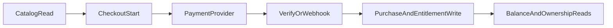

## Primary backend components

- `server/product-actions.ts`
- `server/purchase-actions.ts`
- `server/dsports-cash-actions.ts`
- `app/api/products/route.ts`
- `app/api/checkout/crypto/route.ts`
- `app/api/checkout/crypto/verify/route.ts`
- `app/api/checkout/dsports-cash/route.ts`
- `app/api/webhooks/revenuecat/route.ts`
- `app/api/v1/product_entitlement_mapping/route.ts`

## Core model touchpoints

- `Product`
- `ProductPurchase`
- `PendingPurchase`
- `DsportsCashTier`
- `DsportsCashPurchase`

## High-level flow

## Architectural notes

- Multiple payment rails are supported with verification endpoints.
- Purchase writes and entitlement mapping are decoupled so reconciliation can run independently.
- dsports-cash has dedicated tier and purchase entities separate from product purchases.
