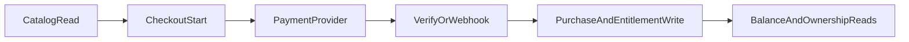

## Primary backend components

- `server/product-actions.ts`
- `server/purchase-actions.ts`
- `server/dsports-cash-actions.ts`
- `app/api/products/route.ts`
- `app/api/checkout/crypto/route.ts`
- `app/api/checkout/crypto/verify/route.ts`
- `app/api/checkout/dsports-cash/route.ts`
- `app/api/webhooks/revenuecat/route.ts`
- `app/api/v1/product_entitlement_mapping/route.ts`

## Core model touchpoints

- `Product` / `Pack` — catalog items
- `ProductPurchase` / `PackPurchase` — completed purchase records (D-Sports Cash and crypto)
- `PendingPurchase` — in-flight crypto payments awaiting verification
- `DsportsCashTier` — purchasable cash bundles (RevenueCat products)
- `DsportsCashPurchase` — RevenueCat-originated cash top-up records

## High-level flow

## Architectural notes

- Multiple payment rails are supported with verification endpoints.
- Purchase writes and entitlement mapping are decoupled so reconciliation can run independently.
- D-Sports Cash checkout uses **Serializable** transaction isolation with automatic retry on `P2034` conflicts, preventing double-spend under concurrent requests.
- D-Sports Cash top-ups (via RevenueCat) use dedicated `DsportsCashTier` and `DsportsCashPurchase` entities, while D-Sports Cash spending creates standard `ProductPurchase` or `PackPurchase` records.
