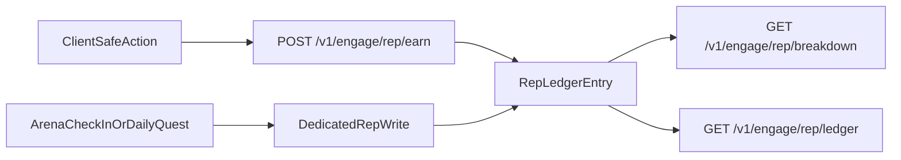

## Primary backend components

- `app/api/v1/engage/rep/breakdown/route.ts`
- `app/api/v1/engage/rep/ledger/route.ts`
- `app/api/v1/engage/rep/earn/route.ts`
- `server/rep-breakdown.ts`
- `RepLedgerEntry` in `prisma/schema.prisma`

## Core model

`RepLedgerEntry` is the source of truth. Breakdown sums `amount` by `repType`:

| `repType` | Client source label |
| --- | --- |
| `Fan` | `fanAmp` |
| `Club` | `club` |
| `Player` | `playerAmp` |

`playerChallenge` writes map to `playerAmp` on the ledger read path.

Club rows may store a `targetId`. Only target IDs that resolve to a `Team` appear in `clubRepByTeam`. Daily-quest Club rows that target a quest id still count in `clubRep` but are dropped from the per-team list.

## High-level flow

## Architectural notes

- Amount and `repType` are never client-authoritative.
- Fan Rep is a separate ledger from `PointsHistory`.
- D-Sports Direct is a reserved fourth bucket with no writer today.
