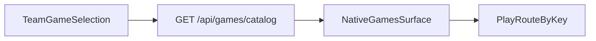

## Primary backend components

- `app/api/games/catalog/route.ts`
- `Game`, `TeamGame`, `TeamGameSchedule`, `FeaturedGames` in Prisma
- Play routers under `app/api/games/daily-spin`, `guess-player`, `live`, and `pick-em`
- Game Center routers under `app/api/events/*`
- Admin selection: `app/api/admin/teams/[teamId]/games`

## Core model touchpoints

- `Game` — catalog entry with cadence (`DAILY` / `WEEKLY`) and status
- `TeamGame` — which games a team has enabled
- `LiveGameSession`, `LiveGamePlayer`, `LiveGamePayout` — live session state
- `GuessPlayerSession` — guess-the-player session
- `SpinWheelSegment`, `DailySpinDayUsage` — daily spin configuration and usage

## High-level flow

## Architectural notes

- The catalog is the public, cacheable mini-game discovery contract. Game Center schedule and detail live under `/api/events/*`.
- Clients map `key` to a local route. Unknown keys must be ignored, not guessed.
- Admin catalog management is documented with redaction only.
