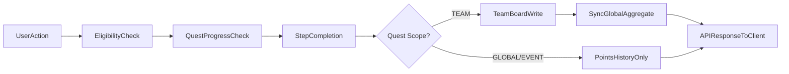

## System boundaries

Gamification in `d-sports-api` is primarily implemented in:

- `server/quest-actions.ts` — quest lifecycle, team eligibility gates, step completion, scoped point writes
- `server/leaderboard-actions.ts` — `syncUserGlobalAggregateFromTeamBoards()` and leaderboard mutations
- `server/daily-quest-actions.ts` — daily visit quest logic
- `lib/leaderboard.ts` — `getOrCreateTeamLeaderboard()`, `getGlobalLeaderboard()`, `getActiveSeason()`
- `lib/favorites.ts` — `resolveUserFavoriteTeamIds()` for favorite team authority
- `app/api/leaderboard/route.ts` — leaderboard read endpoint with trend calculation
- `app/api/rewards/*` — reward claim and redeem routes
- `prisma/schema.prisma` — gamification models including `QuestScope` enum

## Core models

- `Quest` and `QuestStep`: quest definitions with `scope` (GLOBAL | TEAM | EVENT), `teamId`, and ordered steps with `stepCode`.
- `UserQuestStatus` and `UserStepStatus`: per-user quest and step progression.
- `PointsHistory`: append-only points ledger scoped by `leaderboardId` and `seasonId`.
- `Leaderboard` and `LeaderboardEntry`: board membership and denormalized board points.
- `LeaderboardSeason`: season lifecycle metadata.
- `Reward` and `UserReward`: reward catalog and user claim state.

## Cross-feature flow

## Team-scoped quest architecture

Quests use a `QuestScope` enum to determine behavior:

- **GLOBAL** — available to all users, points recorded in history only.
- **TEAM** — tied to a team via `teamId`. Eligibility requires the team to be in the user's favorites. Paid-pass cadence quests additionally require a purchased team pass. Points write to the team leaderboard.
- **EVENT** — time-limited quests, points recorded in history only.

## Pass-gated eligibility

TEAM quests with `cadence: PAID_PASS` require the user to hold a completed purchase of a fan/season pass product linked to that team. The `getTeamPaidPassEntitlements()` function checks `ProductPurchase` records against the team. Eligibility is enforced at listing, start, and step completion.

## Global ranking derivation

Global leaderboard scores are **not written directly**. Instead:

1. TEAM quest step completions write to the team's `LeaderboardEntry`.
2. `syncUserGlobalAggregateFromTeamBoards()` sums the user's points across all team boards and writes the total to the global board entry.
3. GLOBAL/EVENT quest points are tracked in `PointsHistory` but do not affect leaderboard scores.

## Season scoping rules

- Points writes include `seasonId` and `leaderboardId` where determinable.
- Team board scoring reads are scoped by both active season and board.
- Global board scoring is derived from team board aggregation.
- Legacy rows with null scope are intentionally preserved and treated as historical data.

## Important implementation notes

- GLOBAL/EVENT quest points use `leaderboardId: null` in `PointsHistory` since they don't target a specific board.
- `LeaderboardEntry.points` is the denormalized score used for ranking and is actively maintained by team board writes and global sync.
- Non-admin reset/archive lifecycle paths are intentionally not covered in this gamification section.
