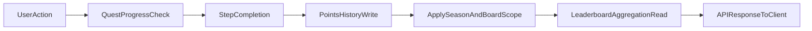

## System boundaries

Gamification in `d-sports-api` is primarily implemented in:

- `server/quest-actions.ts`
- `server/daily-quest-actions.ts`
- `lib/leaderboard.ts`
- `app/api/leaderboard/route.ts`
- `app/api/rewards/*`
- `prisma/schema.prisma` (gamification models)

## Core models

- `Quest` and `QuestStep`: quest definitions and ordered steps.
- `UserQuestStatus` and `UserStepStatus`: per-user quest and step progression.
- `PointsHistory`: append-only points ledger.
- `Leaderboard` and `LeaderboardEntry`: board membership and denormalized board points.
- `LeaderboardSeason`: season lifecycle metadata.
- `Reward` and `UserReward`: reward catalog and user claim state.

## Cross-feature flow

## Season 0.5 scoping rules

- New points writes include `seasonId` and `leaderboardId` where determinable.
- Team board scoring reads are scoped by both active season and board.
- Global board scoring reads are scoped by active season only.
- Legacy rows with null scope are intentionally preserved and treated as legacy data.

## Important implementation notes

- Some flows still use fallback writes with `leaderboardId: null` when board context is unavailable.
- `LeaderboardEntry.points` remains present for compatibility and is planned for later cleanup.
- Non-admin reset/archive lifecycle paths are intentionally not covered in this gamification section.
