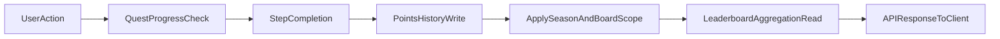

## System boundaries

Gamification in `d-sports-api` is primarily implemented in:

- `server/quest-actions.ts`
- `server/daily-quest-actions.ts`
- `lib/leaderboard.ts`
- `app/api/leaderboard/route.ts`
- `app/api/rewards/*`
- `prisma/schema.prisma` (gamification models)

## Core models

- `Quest` and `QuestStep`: quest definitions and ordered steps.
- `UserQuestStatus` and `UserStepStatus`: per-user quest and step progression.
- `PointsHistory`: append-only points ledger.
- `Leaderboard` and `LeaderboardEntry`: board membership and denormalized board points.
- `LeaderboardSeason`: season lifecycle metadata.
- `Reward` and `UserReward`: reward catalog and user claim state.
- `Achievement`: profile-associated achievement records with badge metadata.
- `FanLevelBadgeDefinition`: configurable fan-level badge tiers (level thresholds, icons, rarity).

### Badge metadata assembly

The `getUser` server action assembles a unified `badgeMetadata` array on the user profile by combining badges from three sources:

1. **Achievements** (`sourceType: "achievement"`) — earned achievement badges.
2. **Rewards** (`sourceType: "reward"`) — claimed reward badges.
3. **Fan level** (`sourceType: "level"`) — a single computed badge based on the user's fan level (derived from total trophies).

Fan-level badge definitions are loaded from `FanLevelBadgeDefinition` records at runtime, with a hardcoded fallback if the database table is empty or unavailable. The `BadgeVariant` enum (`DEFAULT`, `SECONDARY`, `OUTLINE`, `DESTRUCTIVE`, `VERIFIED`, `COUNT`) controls visual presentation across all badge sources.

## Quest assignment domains

- Global quest tracks and team-scoped quest tracks can coexist.
- Team-scoped progression resolves eligibility based on team context and user relationships.
- Quest assignment/read paths should be treated as backend-authoritative.

## Pass-gated eligibility architecture

- Eligibility can be conditioned by **global pass** and **event pass** state.
- Pass checks happen server-side and influence quest visibility/completion pathways.
- Client apps should not hardcode pass logic assumptions.

## Reward pipeline architecture

- Reward outcomes include **free rewards** and **unpaid rewards** semantics.
- Claim/redeem writes are validated against eligibility, status, and prior claims.
- Reward effects propagate into user-visible quest/reward surfaces through API contracts.
- Claimed rewards contribute badge metadata to the user profile response.

## Cross-feature flow

## Season 0.5 scoping rules

- New points writes include `seasonId` and `leaderboardId` where determinable.
- Team board scoring reads are scoped by both active season and board.
- Global board scoring reads are scoped by active season only.
- Legacy rows with null scope are intentionally preserved and treated as legacy data.

## Important implementation notes

- Some flows still use fallback writes with `leaderboardId: null` when board context is unavailable.
- `LeaderboardEntry.points` remains present for compatibility and is planned for later cleanup.
- Non-admin reset/archive lifecycle paths are intentionally not covered in this gamification section.
