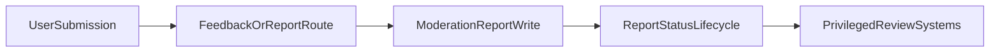

## Primary backend components

- `server/moderation-actions.ts`
- `app/api/feedback/bug-report/route.ts`
- `app/api/feedback/native-crash/route.ts`

## Core model touchpoints

- `ModerationReport`
- `ReportType`
- `ReportStatus`

## High-level flow

## Architectural notes

- Non-admin routes focus on safe intake and structured report persistence.
- Review, escalation, and resolution actions are downstream and generally privileged.
- Feedback intake and moderation-report entities are related but may originate from separate route families.
