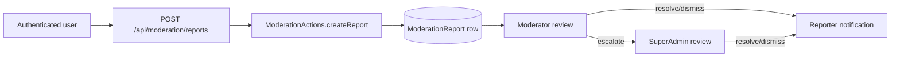

## Primary backend components

- `app/api/moderation/reports/route.ts` — user-facing report intake endpoint
- `server/moderation-actions.ts` — `ModerationActions` class (create, list, escalate, resolve reports; delete content)
- `lib/notifications/service.ts` — `createNotification` for reporter outcome delivery
- `app/api/feedback/bug-report/route.ts` — bug report intake
- `app/api/feedback/native-crash/route.ts` — native crash report intake

## Core model touchpoints

- **`ModerationReport`** — persisted report entity with reporter, target(s), type, status, escalation, and resolution fields
- **`ReportType`** — `INAPPROPRIATE_NAME | INAPPROPRIATE_CONTENT | SPAM | HARASSMENT | OTHER`
- **`ReportStatus`** — `PENDING | ESCALATED | REVIEWED | RESOLVED | DISMISSED`

## High-level flow

## Architectural notes

- The `POST /api/moderation/reports` route validates the payload (type, reason, at least one target) then delegates to `ModerationActions.createReport`.
- Reports start with `PENDING` status. Moderators can escalate to superadmins; both can resolve or dismiss.
- On resolution, the system sends an in-app and push notification (`MODERATION_REPORT_UPDATE`) to the original reporter via `createNotification`.
- Feedback intake (`/api/feedback/*`) and moderation reports (`/api/moderation/reports`) are separate route families with different auth requirements.
