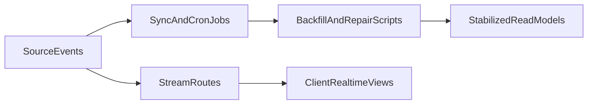

## Primary backend components

- Stream routes (leaderboard and locker-room stream endpoints)
- Non-admin cron/integration routes (for trend sync and similar tasks)
- Sync and backfill scripts under `scripts/` for data consistency
- Shared infra utilities (`logger`, retry/fetch helpers, env loaders)

## Core operational patterns

- Event stream delivery to clients with reconnect-aware client behavior
- Background synchronization for derived datasets
- Offline correction/backfill for historical inconsistencies

## High-level flow

## Architectural notes

- Platform scripts are critical for migration-era and reconciliation tasks.
- Stream and sync systems are supportive layers for product features, not separate product domains.
- Operational runbooks should align with schema and API evolution.
