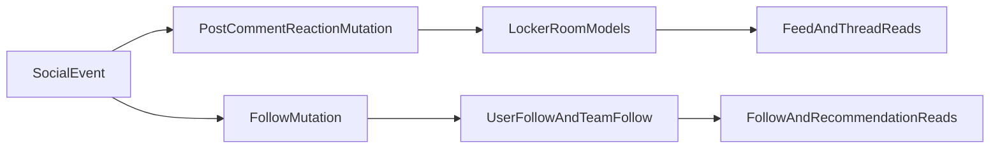

## Primary backend components

- `server/locker-room-actions.ts`
- `server/reaction-actions.ts`
- `server/team-follow-actions.ts`
- `app/api/locker-room/route.ts` — list and create posts
- `app/api/locker-room/[id]/route.ts` — get, edit, and delete a single post
- `app/api/locker-room/[id]/comments/route.ts` — list, create, edit, and delete comments
- `app/api/locker-room/[id]/react/route.ts`
- `app/api/user/follow/route.ts`
- `app/api/user/followers/route.ts`

## Core model touchpoints

- `LockerRoomPost`
- `LockerRoomPostComment`
- `LockerRoomPostReaction`
- `LockerRoomPostLike`
- `UserFollow`
- `TeamFollow`

## High-level flow

## Architectural notes

- Social endpoints combine immediate write paths with read endpoints for feed composition.
- Stream endpoints support near-real-time update delivery patterns.
- Social and follow features are separate model families that intersect through user identity.
