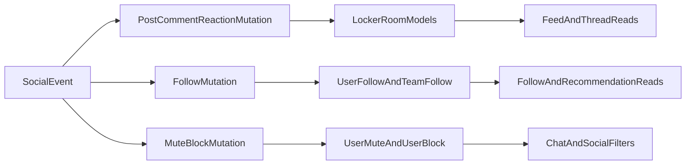

## Primary backend components

- `server/locker-room-actions.ts`
- `server/reaction-actions.ts`
- `server/team-follow-actions.ts`
- `app/api/locker-room/route.ts`
- `app/api/locker-room/[id]/comments/route.ts`
- `app/api/locker-room/[id]/react/route.ts`
- `app/api/locker-room/[id]/like/route.ts`
- `app/api/locker-room/posts/draft/route.ts`
- `app/api/user/follow/route.ts`
- `app/api/user/followers/route.ts`
- `app/api/user/mutes/route.ts`
- `app/api/user/blocks/route.ts`

## Core model touchpoints

- `LockerRoomPost`
- `LockerRoomPostComment`
- `LockerRoomPostReaction`
- `LockerRoomPostLike`
- `UserFollow`
- `TeamFollow`
- `UserMute`
- `UserBlock`

## High-level flow

```mermaid
flowchart LR
  socialEvent[SocialEvent] --> postMutation[PostCommentReactionMutation]
  socialEvent --> followMutation[FollowMutation]
  socialEvent --> safetyMutation[MuteBlockMutation]
  postMutation --> socialModels[LockerRoomModels]
  followMutation --> followModels[UserFollowAndTeamFollow]
  safetyMutation --> safetyModels[UserMuteAndUserBlock]
  socialModels --> feedRead[FeedAndThreadReads]
  followModels --> recommendRead[FollowAndRecommendationReads]
  safetyModels --> filteredReads[ChatAndSocialFilters]
```

## Architectural notes

- Social endpoints combine immediate write paths with read endpoints for feed composition.
- Stream endpoints support near-real-time update delivery patterns.
- Social and follow features are separate model families that intersect through user identity.
- `UserMute` and `UserBlock` are separate edges. Mute hides without notifying; block is the stronger exclusion used by native safety UI.
- `LockerRoomPost.teamId` is the about-tag. `LockerRoomPost.authorTeamId` is the post-as-team identity and is authorized separately.
- Lineup attachments persist on the post row and are echoed to clients. Composer drafts are a separate authenticated resource.
