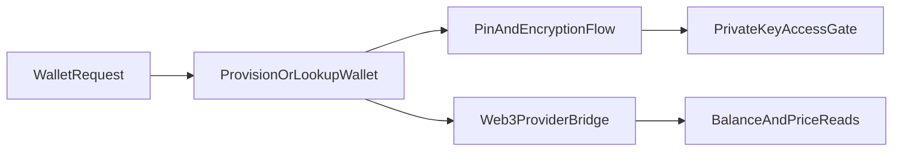

## Primary backend components

- `server/wallet-actions.ts`
- `server/wallet-pin-actions.ts`
- `app/api/wallets/route.ts`
- `app/api/wallets/private-key/route.ts`
- `app/api/wallets/set-pin/route.ts`
- `app/api/wallets/verify-pin/route.ts`
- `app/api/wallets/coin-prices/route.ts`
- `app/api/pregen-wallet/route.ts`
- `app/api/thirdweb-link/route.ts`
- `app/api/thirdweb-proxy/route.ts`

## Core model touchpoints

- `Wallet`
- `ConnectedAccount` (for identity-linked provider relationships)
- encryption/PIN support utilities in wallet libs

## High-level flow

## Architectural notes

- Wallet secrets are protected via encryption and PIN-gated flows.
- Web3 provider proxy routes isolate external provider contracts from clients.
- Checkout and token balance features consume wallet/web3 utilities as dependencies.
