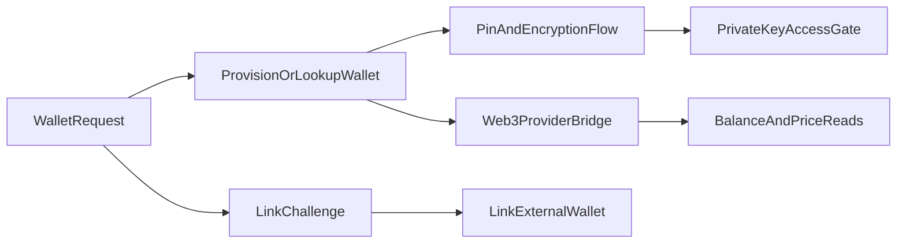

## Primary backend components

- `server/wallet-actions.ts`
- `server/wallet-pin-actions.ts`
- `app/api/wallets/route.ts`
- `app/api/wallets/link-challenge/route.ts`
- `app/api/wallets/link-external/route.ts`
- `app/api/wallets/private-key/route.ts`
- `app/api/wallets/set-pin/route.ts`
- `app/api/wallets/verify-pin/route.ts`
- `app/api/wallets/coin-prices/route.ts`
- `app/api/pregen-wallet/route.ts`
- `app/api/thirdweb-link/route.ts`
- `app/api/thirdweb-proxy/route.ts`

## Core model touchpoints

- `Wallet`
- `ConnectedAccount` (for identity-linked provider relationships)
- encryption/PIN support utilities in wallet libs

## High-level flow

## External wallet linking

Users can link wallets from third-party providers (e.g. MetaMask, WalletConnect) through a two-step challenge/verify flow:

1. **Challenge** (`GET /api/wallets/link-challenge`) — generates a one-time SIWE-style message bound to the user session.
2. **Link** (`POST /api/wallets/link-external`) — the client signs the challenge message with the external wallet, then submits the signature along with the `challengeId`, `address`, and `provider` identifier. The server verifies ownership and persists the linked wallet.

Wallet provider assets (logos, icons) are stored in Supabase rather than bundled with the app.

## Architectural notes

- Wallet secrets are protected via encryption and PIN-gated flows.
- External wallets use SIWE-style signature verification instead of storing private keys.
- Web3 provider proxy routes isolate external provider contracts from clients.
- Checkout and token balance features consume wallet/web3 utilities as dependencies.
